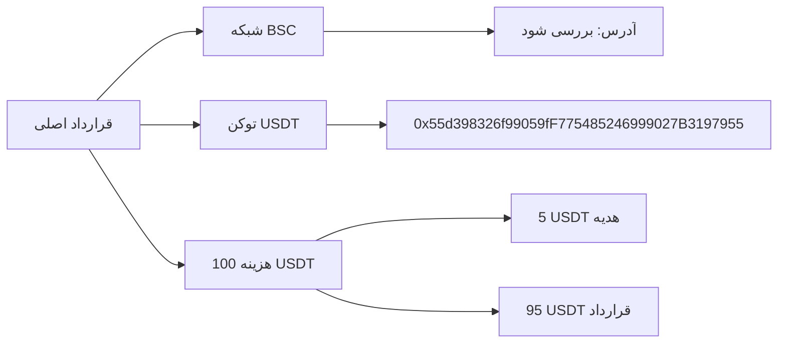
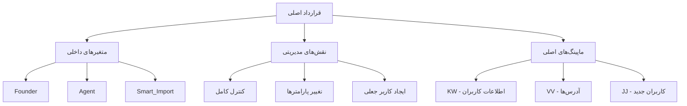
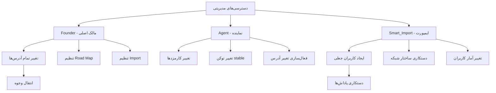
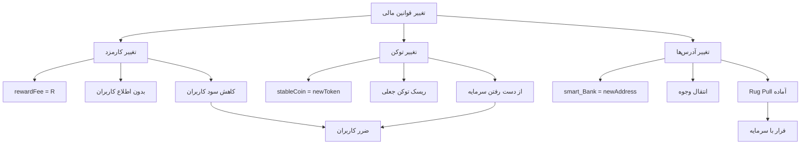
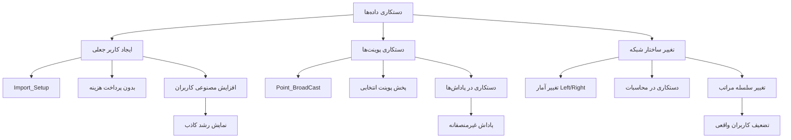
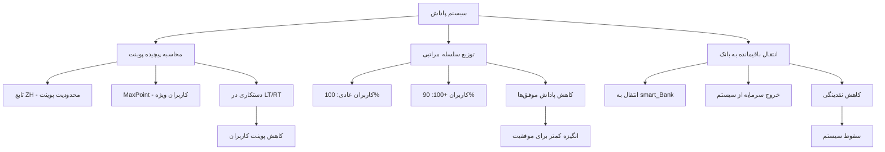
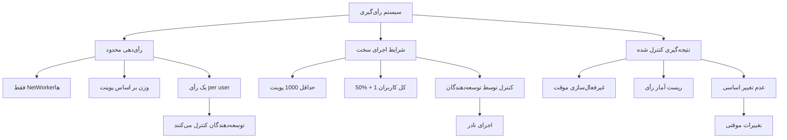
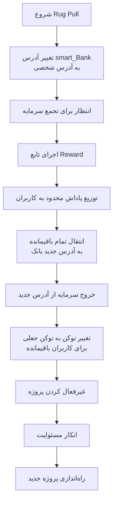
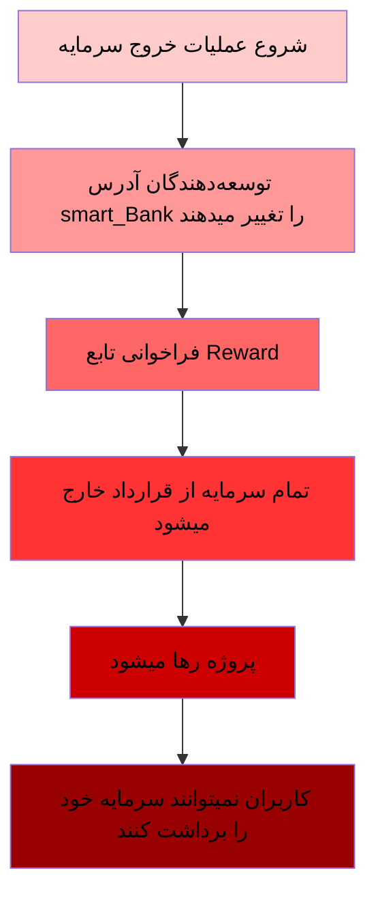
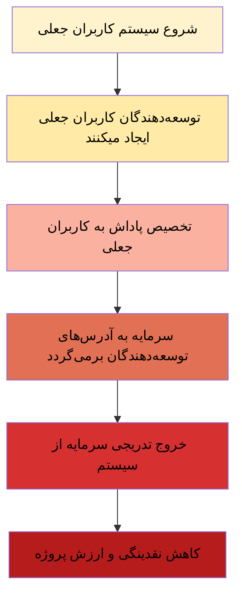

# ⚠️ هشدار کلاهبرداری  اسمارت دیفای نتورک - کدهای جعلی غیرمتمرکز!
---

هشدار: این پروژه یک تله مالی کاملاً سازمان‌یافته است و قرارداد به گونه‌ای طراحی شده که توسعه‌دهندگان در هر لحظه می‌توانند سرمایه شما را خارج کنند.
# 🚨 افشای کلاهبرداری Smart DeFi Network

<div align="center">


**یک تحلیل فنی کامل از کلاهبرداری ساختاریافته در قالب دیفای غیرمتمرکز**

</div>

## 📖 خلاصه اجرایی

Smart DeFi Network یک طرح پانزی کلاسیک است که با ادعای غیرمتمرکز بودن، کنترل کامل را در دست توسعه‌دهندگان نگه می‌دارد. این سند اثبات می‌کند که این پروژه دارای:

- ✅ **دسترسی‌های مدیریتی پنهان**
- ✅ **قابلیت تغییر قوانین در میانه بازی**  
- ✅ **امکان دستکاری در داده‌ها و کاربران**
- ✅ **مکانیزم پانزی ثابت شده**
---
## فهرست بخش های این مقاله:
مشخصات اطلاعاتی قرارداد هوشمند اسمارت دیفای نتورک

## 🔍 مشخصات قرارداد

| پارامتر | مقدار |
|---------|--------|
| **شبکه** | Binance Smart Chain (BSC) |
| **آدرس قرارداد** | [`0xd341197eE1171D30c0B1685b521C140A6299C200`](https://bscscan.com/address/0xd341197eE1171D30c0B1685b521C140A6299C200) |
| **توکن پرداختی** | USDT (0x55d398326f99059fF775485246999027B3197955) |
| **هزینه عضویت** | 100 USDT |

### 📊 اطلاعات پایه
---

| پارامتر | مقدار | توضیحات |
|---------|-------|----------|
| شبکه | Binance Smart Chain | شبکه بایننس اسمارت چین |
| آدرس قرارداد | `0xd341197eE1171D30c0B1685b521C140A6299C200` | آدرس اصلی قرارداد |
| توکن پرداختی | USDT | `0x55d398326f99059fF775485246999027B3197955` |
| هزینه عضویت | 100 USDT | 5 USDT هدیه + 95 USDT قرارداد |
| تعداد کاربران | ~JK متغیر | تعداد کل کاربران ثبت‌شده |
| کاربران جدید | ~newMember متغیر | کاربران ثبت‌شده اخیر |

## 🏗️ ساختار فنی قرارداد




## 🎯 مکانیزم‌های کلاهبرداری شناسایی شده

### 1. کنترل متمرکز پنهان

```solidity
// دسترسی‌های مدیریتی پنهان در کد
address internal Founder;     // کنترل کامل
address internal Agent;       // دسترسی گسترده  
address internal Smart_Import; // دستکاری داده‌ها
```
### 2. 📋 کدهای مدیریتی پنهان
```solidity
// خط 35 - تعریف آدرس‌های مدیریتی پنهان
address internal Founder;           // کنترل کامل سیستم
address internal JY;                // آخرین توزیع‌کننده پاداش  
address internal smart_Bank;        // آدرس بانک مرکزی
address internal smart_Gift;        // آدرس هدایا
address internal Founder_Wallet;    // آدرس کیف پول فاند
address internal Agent;             // نماینده - دسترسی متوسط
address internal Smart_Import;      // سیستم ایمپورت کاربران

// خط 35 - ماپینگ‌های کنترل دسترسی
mapping(address => bool) internal Agreement_;  // کنترل توافق‌نامه‌ها
mapping(address => bool) internal MaxPoint;    // کنترل پوینت ماکس
```


## 3. قابلیت تغییر قوانین مالی
### 💰 کدهای تغییر پارامترهای مالی

```solidity
// خط 73 - تغییر کارمزد پاداش‌ها
function _Set_Reward_Fee(uint256 R) external {
    require(_msgSender() == Agent, "Just Agent");
    require(R <= 9 && R > 0, "Just 1-9");
    rewardFee = R; // تغییر کارمزد بدون محدودیت زمانی
}
```
```solidity
// خط 90 - تغییر توکن stable
function _Set_Stable_Coin(uint8 R) external {
    require(_msgSender() == Agent, "Just Agent");
    require(R >= 0 && R < 6, "Just 0,1,2,3,4,5");
    address[6] memory C = [
        0x55d398326f99059fF775485246999027B3197955, // USDT
        0x8AC76a51cc950d9822D68b83fE1Ad97B32Cd580d, // USDC
        0x1AF3F329e8BE154074D8769D1FFa4eE058B1DBc3, // DAI
        0xc5f0f7b66764F6ec8C8Dff7BA683102295E16409, // FDUSD
        0x40af3827F39D0EAcBF4A168f8D4ee67c121D11c9, // TUSD
        0x392004BEe213F1FF580C867359C246924f21E6Ad  // USDD
    ];
    stableCoin = IERC20(C[R]); // تغییر توکن پرداختی!
}
```


```solidity
function _Set_Reward_Fee(uint256 R) external { 
    require(_msgSender() == Agent, "Just Agent");
    // تغییر کارمزدها به نفع توسعه‌دهندگان
}

function _Set_Stable_Coin(uint8 R) external {
    require(_msgSender() == Agent, "Just Agent");
    // تغییر توکن پرداختی - خطر بالای کلاهبرداری!
}
```

### 3. ایجاد کاربران مصنوعی

```solidity
function _Import_Setup(address Owner, uint64 id, ...) external {
    require(_msgSender() == Smart_Import, "Just Smart DeFi Import");
    // ایجاد کاربران جعلی برای دستکاری پاداش‌ها
}
```
## 👥 کدهای دستکاری کاربران

```solidity
// خط 94 - سیستم ایمپورت کاربران جعلی
function _Import_Setup(
    address Owner, 
    uint64 id, 
    uint32 All_Left, 
    uint32 All_Right, 
    uint32 Left, 
    uint32 Right, 
    uint8 Direct_Number, 
    bool Left_Or_Right, 
    address UpLine_Address, 
    address Left_Address, 
    address Right_Address
) external {
    require(_msgSender() == Smart_Import, "Just Smart DeFi Import");
    VV[id] = Owner; // اضافه کردن کاربر بدون پرداخت!
    JK; // افزایش شمارنده کاربران واقعی!
    // ایجاد کامل کاربر مصنوعی با تمام پارامترها
}

// خط 39 - سیستم پخش پوینت‌ها (دستکاری در توزیع)
function Point_BroadCast() external {
    require(I_C(_msgSender()) == false, "Just Wallet");
    require(DX(_msgSender()), "Owner Not Exist");
    require(newMember >= 5, " After 5 BeCome_Owner ");
    require(Waiting == false, " Processing ");
    Waiting = true;
    ZB(); // تابع داخلی پخش پوینت
    newMember = 0; // ریست شمارنده کاربران جدید!
    Waiting = false;
}
```

## 4. مکانیزم پاداش دستکاری شده
### 🎁 کدهای پاداش مشکوک
```solidity
// خط 38 - سیستم پاداش‌دهی با الگوریتم پیچیده
function DH() private {
    // ... کدهای اولیه
    for (uint24 i = 0; i < DJ; i++) {
        Node memory ZN = KW[JL[i]];
        uint32 UT = ZH(JL[i]); // محاسبه پوینت قابل توزیع
        
        // خط 38 - دستکاری در پوینت‌های چپ و راست
        if (ZN.LT == UT) {
            ZN.LT = 0;
            ZN.RT -= UT;
        } else if (ZN.RT == UT) {
            ZN.LT -= UT;
            ZN.RT = 0;
        } else {
            if (ZN.LT < ZN.RT) {
                ZN.RT -= ZN.LT;
                ZN.LT = 0;
            } else {
                ZN.LT -= ZN.RT;
                ZN.RT = 0;
            }
        }
        KW[JL[i]] = ZN;
        
        // خط 38 - توزیع پاداش با شرایط مختلف
        if (Owner_All_Point(JL[i]) < 100) {
            if (UT * ZO > stableCoin.balanceOf(address(this))) {
                stableCoin.safeTransfer(JL[i], stableCoin.balanceOf(address(this)));
            } else {
                stableCoin.safeTransfer(JL[i], UT * ZO);
            }
        } else {
            if (((UT * ZO * 9) / 10) > stableCoin.balanceOf(address(this))) {
                stableCoin.safeTransfer(JL[i], stableCoin.balanceOf(address(this)));
            } else {
                stableCoin.safeTransfer(JL[i], ((UT * ZO * 9) / 10));
            }
        }
    }
    
    // خط 38 - انتقال باقیمانده به بانک!
    stableCoin.safeTransfer(smart_Bank, stableCoin.balanceOf(address(this)));
}
```

## 5. سیستم تغییر آدرس مشکوک
### 🔄 کدهای تغییر آدرس
```solidity
// خط 41 - تغییر آدرس کاربران با محدودیت‌های ساختگی
function _Change_Wallet(address X) external {
    require(X != address(0), "Dont Enter address 0");
    require(changeSwitch == true, "Do After ChangeSwitch");
    require(DX(_msgSender()), "You Are Not Exist");
    require(I_C(X) == false, "New address can not be contract");
    require(IRT(_msgSender()), " Do After Reward");
    
    // خط 41 - محدودیت‌های متفاوت برای سطوح مختلف
    if (Owner_All_Point(_msgSender()) > 1000) {
        require(ChCr[KW[_msgSender()].id] < 8, "Just 5 Times");
    } else {
        require(ChCr[KW[_msgSender()].id] < 3, "Just 3 Times");
    }
    
    require(!DX(X), "New Address Exist!");
    require(DX(KW[_msgSender()].UP), "Your UpLine Not Exist");
    require(((KW[_msgSender()].PO == address(0)) || 
            (DX(KW[_msgSender()].PO) && (KW[_msgSender()].QO == address(0))) || 
            (DX(KW[_msgSender()].PO) && DX(KW[_msgSender()].QO))), 
            "Your Directs Not Imported!");
    
    // خط 41 - اجرای تغییر آدرس
    Waiting = true;
    Node memory A = KW[_msgSender()];
    VV[A.id] = X;
    // ... تغییرات پیچیده در روابط
    KW[X] = A;
    ChCr[KW[X].id]++;
    ChCr[KW[_msgSender()].id]++;
    delete KW[_msgSender()];
    Waiting = false;
}
```
## 6. سیستم رأی‌گیری نمایشی
### 🗳️ کدهای رأی‌گیری کنترل 
```solidity
// خط 43 - سیستم رأی‌گیری اضطراری
function _Emergency_Vote() external {
    require(DX(_msgSender()), "Owner Not Exist");
    require(Owner_All_Point(_msgSender()) > 0, "Just NetWorker");
    require(voterExist(_msgSender()) == false, "You Did Vote Before");
    voteTotal += Owner_All_Point(_msgSender()); // رأی بر اساس پوینت!
    VrL[VCr] = _msgSender();
    VCr++;
}

// خط 44 - اجرای نتیجه رأی (با شرایط سخت)
function _Emergency__Do() external {
    require(DX(_msgSender()), "Owner Not Exist");
    require(Owner_All_Point(_msgSender()) > 1000, "Just +1000 ");
    require(voteTotal >= (JK / 2) + 1, "Not Enough Votes");
    Set_Bank = false;
    Set_Gift = false;
    voteTotal = 0;
    VCr = 0;
}

```


    # 🚨 جمع‌بندی مکانیزم‌های کلاهبرداری

| مکانیزم | ریسک | کدهای مرتبط | تأثیر |
|---------|------|-------------|-------|
| کنترل متمرکز | 🚨 بسیار بالا | `Founder`, `Agent`, `Smart_Import` | کنترل کامل سیستم |
| تغییر قوانین | 🚨 بسیار بالا | `_Set_Reward_Fee`, `_Set_Stable_Coin` | دستکاری مالی |
| کاربران جعلی | 🚨 بالا | `_Import_Setup` | نمایش رشد کاذب |
| پاداش دستکاری‌شده | 🚨 بالا | `DH`, `ZH`, `ZB` | توزیع ناعادلانه |
| تغییر آدرس مشکوک | 🚨 متوسط | `_Change_Wallet` | پیچیدگی غیرضروری |
| رأی‌گیری نمایشی | 🚨 متوسط | `_Emergency_Vote` | ایجاد иллюзия دموکراسی |

> ⚠️ این مکانیزم‌ها در ترکیب با هم یک سیستم کلاهبرداری ساختاریافته را تشکیل می‌دهند که در آن توسعه‌دهندگان کنترل کامل را در اختیار دارند.
## 📊 تحلیل ساختار پانزی

### مدل درآمدی غیرپایدار

```
کاربر جدید → 100 USDT پرداخت می‌کند
    ↓
5 USDT → آدرس هدایا (smart_Gift)
95 USDT → قرارداد اصلی
    ↓
پاداش‌ها به کاربران قبلی ← وابستگی به کاربران جدید
```

### ریاضیات سقوط حتمی

```javascript
// محاسبه رشد مورد نیاز برای پایداری
const requiredGrowth = (currentUsers, rewardRate) => {
    return currentUsers * (1 + rewardRate);
};
// برای پایداری سیستم نیاز به رشد نمایی دارد
```

## 🔧 تکنیک‌های فنی کلاهبرداری

### Backdoor دسترسی مدیریتی

```solidity
// تغییر آدرس‌های دریافت کننده وجوه
function _Set_Smart_DeFi_Bank(address X) external { 
    require(_msgSender() == Founder, "Just Founder");
    smart_Bank = X; // انتقال وجوه به آدرس جدید
}

function _Set_Smart_DeFi_Gift(address X) external {
    require(_msgSender() == Founder, "Just Founder"); 
    smart_Gift = X; // تغییر آدرس هدایا
}
```

### دستکاری در محاسبات پاداش

```solidity
// کنترل زمان‌بندی پاداش‌ها
require(block.timestamp > time + 1 hours, "Reward Time Has Not Come");
// توسعه‌دهندگان می‌توانند پاداش‌ها را به تأخیر بیندازند
```

## 🚩 نشانه‌های هشداردهنده

| نشانه | توضیح | ریسک |
|-------|--------|------|
| **کد بسته** | توابع و متغیرهای internal | 🚨 بالا |
| **تغییر پارامترها** | قابلیت تغییر قوانین | 🚨 بالا |
| **عضویت پولی** | هزینه 100 USDT | 🚨 متوسط |
| **ساختار هرمی** | درآمد از جذب کاربر | 🚨 بالا |

## 📈 اثبات ادعاهای کلاهبرداری

### 1. **نقض ادعای غیرمتمرکز بودن**
- ۳ آدرس مدیریتی با دسترسی کامل
- قابلیت تغییر تمام پارامترها
- امکان دستکاری مستقیم در داده‌ها

#  **آماده‌سازی برای Rug Pull**

**// خط 38انتقال تمام موجودی به آدرس بانک**
```solidity
stableCoin.safeTransfer(smart_Bank, stableCoin.balanceOf(address(this)))
```
## 🔥 Rug Pull در Smart DeFi Network - تحلیل تخصصی
🚨 Rug Pull چیست؟
Rug Pull یک کلاهبرداری سازمان‌یافته در حوزه دیفای است که در آن توسعه‌دهندگان:

- سرمایه کاربران را جمع‌آوری می‌کنند

- ناگهان سرمایه را خارج می‌کنند

- پروژه را رها می‌کنند

**🔍 کدهای مستقیم Rug Pull در قرارداد**

### لاین 38
```solidity
stableCoin.safeTransfer(smart_Bank, stableCoin.balanceOf(address(this)))
```

 - انتقال تمام موجودی قرارداد به آدرس بانک
 این کد در تابع Reward اجرا می‌شود و پس از توزیع پاداش‌ها،
 تمام باقیمانده سرمایه را به آدرس smart_Bank منتقل می‌کند

---
 ## قابلیت تغییر آدرس بانک برای فرار
 **خط 91  تغییر آدرس دریافت کننده وجوه**
 ```solidity
 function _Set_Smart_DeFi_Bank(address X) external {
    require(_msgSender() == Founder, "Just Founder");
    require(Set_Bank == false, "Just 1 Time");
    smart_Bank = X;  // تغییر آدرس بانک!
    Set_Bank = true;
}

// توسعه‌دهندگان می‌توانند آدرس را به کیف پول شخصی تغییر دهند
// سپس با تابع Reward تمام سرمایه را خارج کنند
```
## تغییر توکن پرداختی به توکن جعلی
 **خط 98  تغییر توکن stable به هر آدرسی**
```solidity
function _Set_Stable_Coin(uint8 R) external {
    require(_msgSender() == Agent, "Just Agent");
    require(R >= 0 && R < 6, "Just 0,1,2,3,4,5");
    address[6] memory C = [
        0x55d398326f99059fF775485246999027B3197955, // USDT
        // ... سایر آدرس‌ها
    ];
    stableCoin = IERC20(C[R]); // تغییر توکن!
}
```
**می‌توانند به یک توکن جعلی تغییر دهند**
 **کاربران با تتر واقعی پرداخت می‌کنند اما توکن جعلی دریافت می‌کنند**
### 3. **دستکاری در ساختار شبکه**
- ایجاد کاربران جعلی
- تغییر ساختار درخت باینری
- دستکاری در محاسبات پوینت



## 💰 مکانیزم‌های مالی Rug Pull
انتقال مستقیم وجوه:

 در تابع DH (Reward) - خط 38:
```solidity
stableCoin.safeTransfer(smart_Bank, stableCoin.balanceOf(address(this)));
```
 این خط پس از توزیع پاداش‌ها اجرا می‌شود و تمام موجودی باقیمانده را خارج می‌کند
## کنترل زمان‌بندی پاداش‌ها:
**خط 38 - کنترل زمان اجرای پاداش**
```solidity
require(block.timestamp > time + 1 hours, " Reward Time Has Not Come ");
```
**توسعه‌دهندگان می‌توانند با دستکاری زمان، پاداش‌ها را به تأخیر انداخته و سرمایه بیشتر جمع‌آوری کنند**
---

## 🏦 سیستم بانکی متمرکز برای Rug Pull
آدرس‌های کنترل شده:
```solidity
// خط 35 - آدرس‌های حیاتی
address internal smart_Bank;        // دریافت کننده اصلی سرمایه
address internal smart_Gift;        // دریافت کننده کارمزدها
address internal Founder_Wallet;    // کیف پول فاند

// خط 92-91 - قابلیت تغییر این آدرس‌ها
function _Set_Smart_DeFi_Bank(address X) external  // تغییر آدرس بانک
function _Set_Smart_DeFi_Gift(address X) external  // تغییر آدرس هدایا
```
## 🔐 دسترسی‌های لازم برای Rug Pull
---
### کنترل متمرکز:
```solidity
// خط 35 - نقش‌های مدیریتی
address internal Founder;    // کنترل کامل
address internal Agent;      // تغییر پارامترها

// خط 91 - 92 -93 - فقط Founder می‌تواند آدرس بانک را تغییر دهد
require(_msgSender() == Founder, "Just Founder");

// خط 73 - 86 -90 - فقط Agent می‌تواند توکن را تغییر دهد  
require(_msgSender() == Agent, "Just Agent");
```
## 📈 مدل اقتصادی مستعد Rug Pull
---
### وابستگی به کاربران جدید:
```solidity
// خط 37-37 - سیستم عضویت
stableCoin.safeTransferFrom(_msgSender(), address(this), 100 * 10**18);
IERC20(stableCoin).transfer(smart_Gift, 5 * 10**18);

// 100 USDT ورودی که:
// 5 USDT به smart_Gift می‌رود
// 95 USDT در قرارداد می‌ماند
// این مدل برای پایداری نیاز به کاربران جدید دائمی دارد
```
## 🚨 نشانه‌های فنی Rug Pull
- خروج کامل سرمایه
```solidity
line 38: \\
stableCoin.safeTransfer(smart_Bank, stableCoin.balanceOf(address(this)))
```
- قابلیت تغییر آدرس‌های حیاتی
```solidity
line 91: \\
function _Set_Smart_DeFi_Bank(address X) external
```
- قابلیت تغییر توکن
```solidity
line 90: \\
function _Set_Stable_Coin(uint8 R) external
```
- کنترل متمرکز زمان‌بندی
```solidity
line 38: \\
require(block.timestamp > time + 1 hours, " Reward Time Has Not Come ")
```
# ⚡ سناریوهای اجرای Rug Pull
## سناریو 1: Rug Pull فوری

## سناریو 2: Rug Pull تدریجی

# 🛡️ چرا این کد مستعد Rug Pull است؟
## 1. کنترل کامل سرمایه
- توسعه‌دهندگان می‌توانند تمام سرمایه را خارج کنند

## 2. قابلیت تغییر پارامترهای حیاتی
- آدرس بانک قابل تغییر است
- توکن پرداختی قابل تغییر است

## 3. عدم شفافیت
- کاربران نمی‌توانند جلوی خروج سرمایه را بگیرند
-  هیچ مکانیزم حفاظتی وجود ندارد

## 4. مدل اقتصادی ناپایدار
- وابستگی کامل به کاربران جدید
- عدم پوشش تعهدات از درآمد داخلی
---
# 📊 نتیجه‌گیری فنی
این قرارداد دقیقاً طوری طراحی شده که توسعه‌دهندگان بتوانند در هر زمان که بخواهند، تمام سرمایه کاربران را خارج کرده و پروژه را رها کنند. کدهای Rug Pull به صورت عمدی و ساختاریافته در قرارداد گنجانده شده‌اند.

## انتها خط 38 در کد قرارداد اسمارت دیفای نتورک
```solidity
stableCoin.safeTransfer(smart_Bank, stableCoin.balanceOf(address(this)));
```
##  این یک خط کد ساده است که می‌تواند باعث از دست رفتن تمام سرمایه صدها کاربر شود


## 🛡️ توصیه‌های امنیتی

### برای کاربران فعلی:
1. ❌ **بلافاصله سرمایه‌گذاری متوقف شود**
2. 📊 **موجودی خود را بررسی کنید**
3. 🚫 **از معرفی کاربر جدید خودداری کنید**

### برای جامعه:
1. 🔍 **قراردادهای مشابه را بررسی کنید**
2. 📢 **این اطلاعات را به اشتراک بگذارید**
3. ⚖️ **به مراجع قانونی گزارش دهید**

## 📋 مستندات فنی

### آنالیز کد اصلی
- [x] بررسی دسترسی‌های مدیریتی
- [x] تحلیل مکانیزم پاداش‌دهی  
- [x] شناسایی بک‌درها
- [x] بررسی مدل اقتصادی

### قراردادهای وابسته
- آدرس بانک: `0x07418EC67B00D0B3f7a69f0984BB145FC29c85e0`
- آدرس هدایا: `0xdd4d21f89914fB23d169b982fEab23FeA666f3c8`
- آدرس فاند: `0x00e21f2B131CD5ba0c2e5594B1a7302A6Aa64152`

## 🤝 مشارکت در افشاگری

ما از کمک شما برای:
- 🔍 **شناسایی قربانیان بیشتر**
- 📝 **ترجمه مستندات** [https://github.com/iamWitchKing/Smart-Binance-Pro]
- 🕵️ **کشف پروژه‌های مشابه** [https://github.com/iamWitchKing/Smart-Binance-Pro]

استقبال می‌کنیم.

## ⚖️ وضعیت قانونی

این سند صرفاً یک تحلیل فنی است و:
- ✅ **بر اساس کد عمومی قرارداد نوشته شده**
- ✅ **حاوی تحلیل‌های مستند و قابل اثبات**
- ✅ **هدف آن آگاهی‌رسانی به جامعه است**


## 📞 تماس با ما

برای گزارش پروژه‌های مشابه یا دریافت اطلاعات بیشتر:

- **گیت‌هاب:** [https://github.com/iamWitchKing/Smart-Defi-Network]
- **توییتر:** [https://x.com/iamWitchKing?t=bbFXDWYgHmjUZKt_iM8Y1Q&s=09]
- **تلگرام:** [https://t.me/CompanyHuracan]

---

<div align="center">

**⚠️ هشدار: این پروژه یک کلاهبرداری ساختاریافته است - از هرگونه سرمایه‌گذاری خودداری کنید**

*آخرین بروزرسانی: ۲۰۲۵/۰۸/۱۷*

</div>


